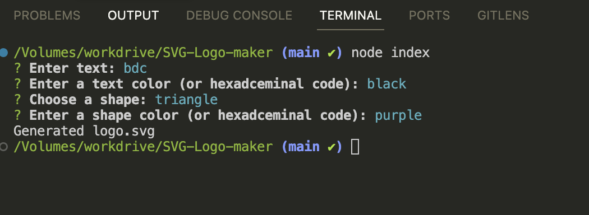

# SVG Logo Maker

## Description

The SVG Logo Maker is a Node.js command-line application designed to generate simple logos in SVG format. Users can input their preferences for text, text color, shape, and shape color, and the application will create a corresponding SVG file. This tool is particularly useful for freelance web developers who need quick and customizable logos without hiring a graphic designer.

## Walkthrough Video

[Walkthrough Video Demonstration](https://drive.google.com/file/d/1z4i1ytKRAo1qkBktsJzOaUcVU0H0lmhU/view)



## Table of Contents

- [Description](#description)
- [Walkthrough Video](#walkthrough-video)
- [Installation](#installation)
- [Usage](#usage)
- [Features](#features)
- [Tests](#tests)
- [Directory Structure](#directory-structure)
- [Additional Resources](#additional-resources)
- [Contributing](#contributing)
- [License](#license)

## Installation

1. Clone the repository to your local machine:
    ```bash
    git clone https://github.com/your-username/svg-logo-maker.git
    ```
2. Navigate to the project directory:
    ```bash
    cd svg-logo-maker
    ```
3. Install the required dependencies:
    ```bash
    npm install
    ```

## Usage

1. Run the application using the following command:
    ```bash
    node index.js
    ```
2. Follow the prompts to enter:
    - Up to three characters of text for the logo
    - A color keyword or hexadecimal number for the text color
    - A shape from the list (circle, triangle, square)
    - A color keyword or hexadecimal number for the shape color
3. After entering all inputs, the application will generate an `logo.svg` file in the project directory.
4. Open the `logo.svg` file in a browser to view the generated logo.

## Features

- Prompt users for text, text color, shape, and shape color
- Generate a custom SVG logo based on user input
- Save the generated SVG to a file named `logo.svg`

## Tests

To run the tests, use the following command:
```bash
npm test
